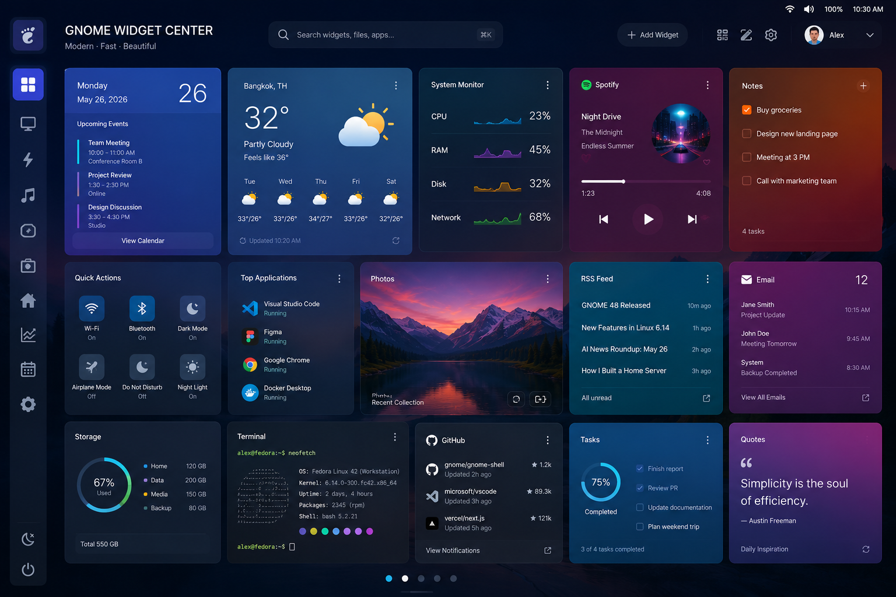

# GNOME Widget Center
[](https://gjs.guide/)
[](https://www.gtk.org/)
[](LICENSE)


A modern desktop widget platform for GNOME Shell.

GNOME Widget Center brings customizable desktop widgets to GNOME Shell through a modern, extensible architecture. Inspired by KDE Plasma Widgets while following the GNOME design philosophy, it provides a clean and consistent platform for building, managing, and sharing desktop widgets.

---


---

## Features

### Desktop Widgets

- Modern dashboard
- Drag & Drop positioning
- Resizable widgets
- Multiple dashboards
- Multi-monitor support
- Responsive layouts

### Widget SDK

Build widgets using a stable and documented API.

Modules include:

- Configuration
- Theme
- Runtime
- Dashboard
- UI
- Notification
- Media
- Network
- Shared Services
- Storage
- Permissions
- Widget Bus
- Logger
- Repository
- AI

Widgets communicate only through the Widget SDK and never access GNOME Shell internals directly.

### Shared Services

Reusable services available to every widget.

- Media Service
- Weather Service
- System Service
- Notification Service
- Repository Service
- AI Service
- Location Service

### Themes

Customize your desktop with portable themes.

Theme packages may include:

- Dashboard appearance
- Colors
- Typography
- Icons
- Widget styles
- Border radius
- Spacing

### Widget Repository *(Planned)*

- Official Repository
- Community Repository
- Automatic Updates
- Version Management
- One-click Installation

### Backup & Restore *(Planned)*

Backup includes:

- Dashboard layouts
- Installed widgets
- Widget configuration
- Themes
- User preferences

---

# Architecture

```
                    Widgets
                        │
                        ▼
                  Widget SDK
                        │
                        ▼
            GNOME Widget Center
     ┌────────────────────────────┐
     │ Dashboard Manager          │
     │ Widget Manager             │
     │ Theme Manager              │
     │ Shared Services            │
     └────────────────────────────┘
                        │
                        ▼
               GNOME Shell Runtime
```

Widgets interact only with the Widget SDK.

The SDK provides a stable API while hiding runtime implementation details from widget developers.

---

# Project Structure

```
gnome-widget-center/

├── architecture/
│   System architecture and design documents
│
├── extension/
│   GNOME Shell Extension
│
├── app/
│   GTK4 / Libadwaita application
│
├── sdk/
│   Widget SDK
│
├── widgets/
│   Official widgets
│
├── docs/
│   Documentation
│
├── tasks/
│   Development tasks
│
├── assets/
│   Screenshots, icons and branding
│
└── tools/
│   Development tools
```

---

# Roadmap

## Phase 1

- Core Runtime
- Widget SDK
- Dashboard
- Preferences
- Drag & Drop

## Phase 2

- Theme Manager
- Widget Repository
- Backup & Restore

## Phase 3

- Widget Store
- AI Services
- Developer SDK
- CLI Tools
- Community Platform

---

# Design Principles

- Native GNOME Experience
- Modern User Interface
- Stable Widget SDK
- Modular Architecture
- Shared Services
- High Performance
- Easy Customization
- Developer Friendly

---

# Documentation

Documentation is available in:

```
docs/
```

Architecture specifications:

```
architecture/
```

Development tasks:

```
tasks/
```

---

# Contributing

Contributions are welcome.

Before opening a Pull Request, please read the documentation and development roadmap.

---

# License


GNOME Widget Center is licensed under the **GNU General Public License v3.0 (GPL-3.0)**.

You are free to use, modify and distribute this software under the terms of the GPL-3.0 license.

See the [LICENSE](LICENSE) file for the full license text.