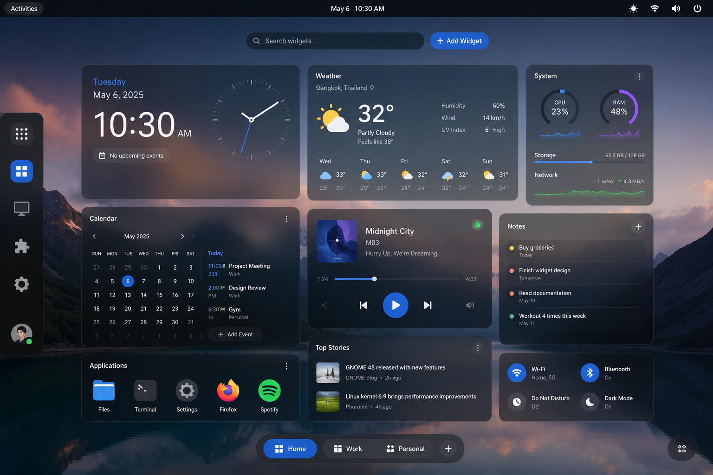

# GNOME Widget Center
[](https://gjs.guide/)
[](https://www.gtk.org/)
[](LICENSE)

A modern desktop widget platform for GNOME Shell built with GJS, GTK4 and Libadwaita.

> **Status:** Pre-Alpha

---

## Overview

GNOME Widget Center is a modern desktop widget platform inspired by KDE Plasma Widgets while following the GNOME Human Interface Guidelines (HIG).

The project is built around three main components:

- GNOME Shell Extension
- GNOME Widget Center Application
- Widget SDK

Widgets never interact directly with GNOME Shell internals. Instead, they communicate exclusively through the Widget SDK, providing a stable and maintainable development environment.

---

## Screenshots

### Dashboard



### Desktop


---

## Current Status

> **หมายเหตุ:** ตอนนี้โปรเจกต์เป็น **GNOME Shell Extension เดียว** (`products/gnome-widget-center@xenlism.github.io/`)
> ยังไม่มี GTK4 Application/SDK แยกต่างหากตามที่ร่างไว้ในหัวข้อ Architecture ด้านล่าง — ทุกอย่างรันอยู่ใน
> process ของ Shell เอง สถานะละเอียดต่อ task ดูที่ `development/tasks/ROADMAP.md`

| Component | Status |
|-----------|--------|
| Architecture / Specifications | ✅ Complete |
| Widget Loader (discover/load, hot-reload dev mode) | ✅ Logic complete |
| Widget Layer (desktop rendering, multi-monitor) | ✅ Logic complete |
| Settings Store (JSON per widget, live cross-process reload) | ✅ Logic complete |
| Preferences (Control Center, declarative settings schema) | ✅ Logic complete |
| Widget Edit Mode (right-click overlay: Settings/Reset/Remove/Uninstall) | ✅ Logic complete |
| Edit Mode Drag & Drop (grid snap, collision avoidance, monitor lock, z-order-to-front) | ✅ Logic complete |
| Grid Engine (16px grid, 5 fixed size presets: Small/Wide/Medium/Large/XLarge) | ✅ Logic complete |
| Appearance Theme (toolbar look via `theme.json`, live reload) | ✅ Logic complete |
| Debug Logging / Dev Mode (Advanced prefs tab) | ✅ Logic complete |
| Widget SDK example pack (clock, media-player via MPRIS) | ✅ Logic complete |
| Packaging & third-party widget docs (`_template/`, `PUBLISHING_A_WIDGET.md`) | ✅ Complete |
| Theme Backup & Restore (`.gwctheme` export/import) | ⏳ Planned — not started |
| GTK4 standalone Application / Widget SDK package / Widget Repository | ⏳ Planned — not started |
| Real GNOME Shell hardware sign-off (release checklist) | 🚧 Partial — spot-tested, no full 1hr clean-run confirmed |

*"Logic complete" = code written and read/tested against acceptance criteria, but not yet formally
signed off end-to-end on a real GNOME Shell session per `development/tasks/10-testing-release.md`.*

---

## Vision

GNOME Widget Center aims to provide:

- Desktop Widgets
- Stable Widget SDK
- Theme Packages
- Widget Repository
- Multi-monitor Support
- GTK4 Preferences
- High Performance
- Developer-friendly APIs

---

## Features

### Desktop Widgets

- Desktop Widget Layer
- Fixed-size Widgets
- 16px Grid Layout
- Drag & Drop
- Desktop Edit Mode
- Right-click Context Menu

### Widget SDK

Widgets communicate through the SDK instead of directly accessing GNOME Shell.

Planned SDK modules include:

- Configuration
- Dashboard
- Theme
- Media
- Network
- Notifications
- Storage
- Logger
- Repository
- AI

### Theme Packages

Theme Packages replace traditional backup and restore.

A package can include:

- Desktop Layout
- Installed Widgets
- Widget Settings
- Theme Configuration
- Wallpaper (Optional)
- Fonts (Optional)

### Widget Repository

Planned features:

- Install Widgets
- Update Widgets
- Search
- Categories
- Ratings
- Screenshots

---

## Architecture

```text
GNOME Widget Center Application
            │
            ▼
       Widget SDK
            │
            ▼
      Widget Runtime
            │
            ▼
GNOME Shell Extension
            │
            ▼
      Desktop Widget Layer
```

---

## Project Structure

```text
development/
├── architecture/
├── roadmap/
├── specifications/
├── tasks/
└── tools/

products/
├── application/
├── extension/
├── sdk/
├── widgets/
└── assets/

website/

docs/
```

---

## Roadmap

### Phase 0 — Foundation

- ✅ Project setup
- ✅ Repository structure
- ✅ Architecture
- ✅ Specifications

### Phase 1 — Core Runtime

- ✅ Widget Loader
- ✅ Widget Layer
- ✅ Widget Runtime
- ✅ Settings Store
- ✅ Drag Runtime (Super+drag, Normal mode)

**Milestone:** Desktop widgets can be displayed. ✅ *(reached — pending real-hardware sign-off)*

### Phase 2 — Desktop Experience

- ✅ Preferences (Control Center, declarative settings schema)
- ✅ Widget Configuration
- ✅ Desktop Edit Mode (right-click overlay + drag-and-drop + grid engine)
- ✅ Multi-monitor Support

**Milestone:** Users can manage widgets visually. ✅ *(reached — pending real-hardware sign-off)*

### Phase 3 — Widget SDK

- ✅ Widget SDK (declarative `metadata.json` contract, `WidgetAPI`)
- ✅ Example Widgets (clock, media-player via MPRIS)
- ✅ Hot Reload
- ✅ Developer Documentation

**Milestone:** Third-party widget development. ✅ *(reached — pending real-hardware sign-off)*

### Phase 4 — Public Preview

- 🚧 Testing (spot-tested on real hardware; full 1hr clean-run not yet confirmed)
- ✅ Packaging (`_template/`, publishing docs)
- ✅ Documentation
- ⏳ Preview Release

### Phase 5 — Themes

- 🚧 Theme Manager *(built so far: visual/appearance theming for the Edit Mode toolbar via
  `theme.json` + live reload — NOT the settings-backup theme described below yet)*
- ⏳ Theme Packages (`.gwctheme` export/import of layout + widget settings)
- ⏳ Import / Export
- ⏳ Theme Sharing

### Phase 6 — Widget Repository

- Online Repository
- Widget Installation
- Widget Updates
- Ratings
- Categories

### Future

- AI Widgets
- Cloud Synchronization
- Online Theme Store
- Community Marketplace

---

## Technology

- GJS
- GTK4
- Libadwaita
- GObject
- GSettings
- Meson
- Flatpak

---

## Contributing

Development documentation is available in the `development` directory.

Contributions, bug reports and feature suggestions are welcome.

---

## License

GNU General Public License v3.0
