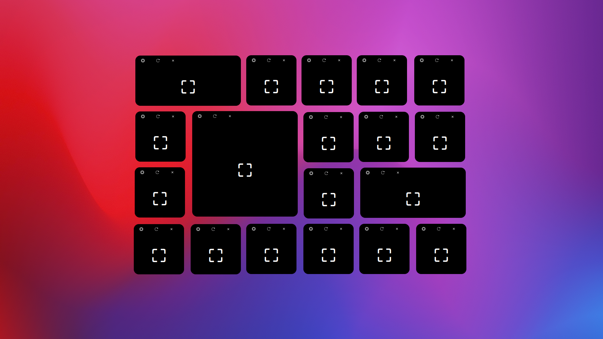
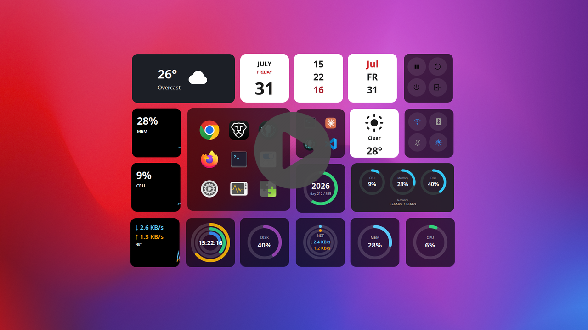

# GNOME Widget Center

[](https://gjs.guide/)
[](https://www.gtk.org/)
[](LICENSE)

A desktop widget platform for GNOME Shell, built with GJS, GTK4, and Libadwaita.

> **Status:** Alpha — feature-complete for a first preview, pending a full
> real-hardware sign-off (see [Current Status](#current-status)).

---

## Overview

GNOME Widget Center brings desktop widgets to GNOME Shell in the spirit of
KDE Plasma Widgets, while following the GNOME Human Interface Guidelines
(HIG). Today the whole project is a single GNOME Shell extension —
`gnome-widget-center@xenlism.github.io/` — that:

- discovers and loads widgets from a folder (bundled, or user-installed
  under `~/.local/share/gnome-widget-center/widgets/`);
- renders them on the desktop with free, pixel-precise placement and
  collision-aware Edit Mode drag-and-drop;
- gives every widget its own settings page, generated automatically from a
  declarative `config.json` (or a hand-written GTK4/libadwaita `prefs.js`
  for anything more custom);
- ships a Control Center (Overview / Themes / Preferences) for managing,
  theming, and configuring widgets, plus theme export/import as portable
  `.gwct` files.

A widget never touches GNOME Shell internals directly — it talks only to
the `WidgetAPI` object the host passes into it. See
[`gnome-widget-center@xenlism.github.io/WIDGET_API.md`](gnome-widget-center@xenlism.github.io/WIDGET_API.md)
for the full widget-author contract, or
[`SKILL.md`](gnome-widget-center@xenlism.github.io/SKILL.md) in
the same folder for the condensed, build-one-now version.

---

## ❤️ Support Development

If you find **GNOME Widget Center** useful, please consider supporting its development.

### Ko-fi

[](https://ko-fi.com/xenlism)

### PayPal

[PayPal QR Code](assets/paypal.jpg)

### USDT (TRC20 Network)

[USDT TRC20 QR Code](assets/usdt.jpg)

Every contribution helps support development, maintenance, bug fixes, and new features.

---
## Screenshots

### Edit Mode ( Settings Reset Move By Right Click Toggle)
**▶️ [Edit Mode](assets/editmode.mp4)**
<video src="assets/editmode.mp4" controls width="1920"></video>



### Desktop



---

## Current Status

The project is currently a **single GNOME Shell extension** — there is no
separate standalone GTK4 application or installable Widget SDK package yet
(see [Vision](#vision) below for where that's headed).

| Area | Status |
|---|---|
| Widget Loader (discover/load, hot-reload dev mode) | ✅ Working |
| Widget Layer (desktop rendering, multi-monitor) | ✅ Working |
| Settings (per-widget JSON, `config.json` schema UI, live cross-process reload) | ✅ Working |
| Control Center (Overview / Store / Preferences, sidebar navigation) | ✅ Working |
| Edit Mode (floating toolbar overlay, free pixel placement, collision avoidance) | ✅ Working |
| Appearance / Theme system (`theme.json`, live `Gio.FileMonitor` reload, per-widget override + global Force) | ✅ Working |
| Theme export/import (`.gwct`, with secret-field redaction and a dependency report) | ✅ Working |
| System dependency checker (`GLib.find_program_in_path()`) | ✅ Working |
| i18n — 6 locales (en, zh, es, th, de, ja) | ✅ Working |
| Bundled widgets (~30, including clock, calendar, weather, system monitors, media player) | ✅ Working |
| Debug logging / dev mode (Advanced prefs tab) | ✅ Working |
| Full real-GNOME-Shell hardware sign-off | 🚧 Spot-tested; no full clean-run confirmation yet |
| Standalone GTK4 application / installable Widget SDK / online widget repository | ⏳ Not started |

"Working" means the code is written, `node --check`-verified, and
exercised in development — not the same as a formal, end-to-end sign-off
on a clean real GNOME Shell session. See
[`gnome-widget-center@xenlism.github.io/PROJECT_STATUS.md`](gnome-widget-center@xenlism.github.io/PROJECT_STATUS.md)
for a running log of recent changes.

---

## Vision

Longer-term, GNOME Widget Center aims to grow beyond a single extension
into:

- A stable, documented Widget SDK third-party developers can build against
- A standalone GTK4 companion application
- A theme/widget repository with install, update, search, and ratings
- Broader SDK surface area (network, notifications, storage, AI) beyond
  what a widget can already do today via `WidgetAPI`

---

## Features

### Desktop widgets

- Fixed-size widgets on a 16px grid, from a closed set of 10 block sizes
  (`1x1` up to `4x4`)
- Free, pixel-precise placement with collision avoidance in Edit Mode
- Drag & drop (Super+drag in normal mode; a floating toolbar overlay in
  Edit Mode)
- Right-click context menu (Settings / Reset / Remove / Uninstall)
- Multi-monitor aware

### Widget authoring

- Drop a folder in and go — no compiled schema, no install step
- Settings UI generated for free from a declarative `config.json`
  (text, location with IP auto-detect, color/font/icon pickers, file/folder
  pickers, installed-app pickers, lists, conditional visibility, and more)
- A hand-written `prefs.js` escape hatch for anything more bespoke
- A reusable MPRIS2 media-player client (`lib/mediaApi.js`) and
  CPU/RAM/network sampler (`lib/systemMetricsApi.js`) for bundled widgets
- A cross-widget event bus, and per-widget/global appearance theming
- Full i18n support across all widgets

### Themes

`.gwct` files export/import a full snapshot — desktop layout, installed
widget settings, and appearance/theme configuration — as a single JSON
file, with sensitive fields (API keys, tokens) automatically redacted on
export.

---

## Project Structure

```text
development/
├── architecture/     # specs, contracts, architecture docs
├── docs/              # WIDGET_API, SETTINGS_SPEC, THEME_SYSTEM, etc.
├── tasks/             # task briefs + ROADMAP.md
└── tests/             # e2e checklist


assets/                                  # screenshots, etc.
gnome-widget-center@xenlism.github.io/   # the extension itself
  ├── lib/           # host services (loader, theme, settings, drag, ...)
  ├── widgets/       # bundled widgets
  ├── i18n/          # locale files
  ├── WIDGET_API.md  # widget author contract (full spec)
  └── SKILL.md       # condensed widget-building guide
```

---

## Technology

- GJS (GNOME JavaScript)
- GTK4 + Libadwaita
- GObject / GSettings
- Meson (packaging)
- GjsKit (Xenlism GJS Framework)

---

## Contributing

Development documentation lives under `development/`. Widget authors
should start with
[`WIDGET_API.md`](gnome-widget-center@xenlism.github.io/WIDGET_API.md).
Contributions, bug reports, and feature suggestions are welcome.

---

## License

GNU General Public License v3.0


## 👥 Visitor

