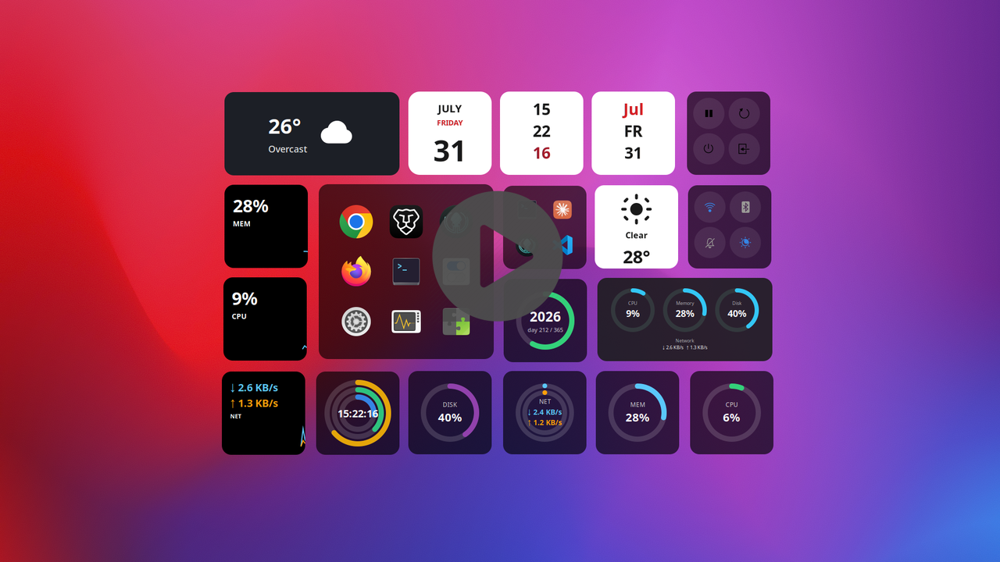
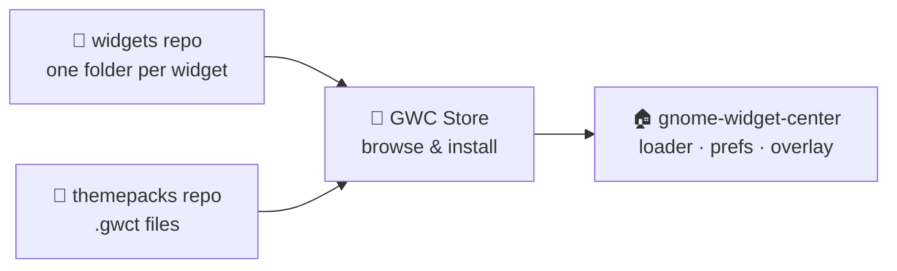
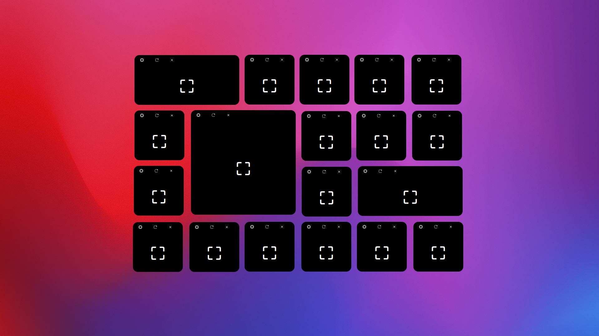

# 🧩 GNOME Widget Center **v2**

**Live desktop widgets for GNOME Shell. Drag them, style them, theme them, share them. 🎨**

[](https://www.gnome.org/)
[](CHANGELOG.md)
[](https://gjs.guide/)
[](https://www.gtk.org/)
[](LICENSE)
[](development/PROJECT_STATUS.md)
[](https://github.com/sponsors/xenlism)

[](https://www.youtube.com/watch?v=LaN50RX_Dcw)

> **Clocks, weather, system monitors, media controls, launchers** and **69 ready-made widgets**
> ready to land on your desktop, plus **33 theme packs** that restyle the whole thing in one click.

---

## 🚀 What's new in v2

v2 is a bigger change under the hood than it looks. The extension core stays lean, and the
things that grow fastest (widgets and theme packs) get their own homes so they can ship on
their own schedule.


```mermaid
flowchart LR
    Core["🏠 gnome-widget-center<br/>loader · prefs · overlay"]
    W["🧱 widgets repo<br/>one folder per widget"]
    T["🎨 themepacks repo<br/>.gwct files"]
    S["🛒 GWC Store<br/>browse &amp; install"]
    W --> S
    T --> S
    S --> Core
```

| | What changed |
| --- | --- |
| 🧱 **Split repositories** | The extension core, the widgets, and the theme packs now live in separate repositories. New widgets and packs can be published without cutting a new extension release. |
| 🛒 **GWC Store** *(in progress)* | A catalog layer on top of those repositories, so you can browse and install widgets and theme packs without leaving the app. |
| 🎨 **Theme packs got smarter** | A `.gwct` now carries **card settings**, a **color scheme** (text 1/2, ring 1-4, accent) and **fonts**, not just per-widget values. Widgets you add later start from the pack's look instead of their own defaults. |
| 🎯 **One theme, every widget** | Applying a pack also updates widgets that are *not* in it, so enabling one afterwards matches your active theme. No more mystery dark card next to a glass one. |
| 🔑 **Unified card settings** | Card options share one naming pattern, `card-[setting]-[sub-setting]` (`card-background-color`, `card-corner-radius`, `card-opacity`, ...), so every widget speaks the same language. |
| 🌍 **45 UI languages** | Region-aware locale loading (`pt_BR`, `pt_PT`, `zh_CN`, `zh_TW`) and a full set of translations. |
| 📥 **Easier install** | One `curl`/`wget` line, a plain `git clone`, or a release archive, and all three go through the same `install.sh`. |

> ⚠️ **Heads-up for existing users and widget authors:** because widgets and packs are leaving the
> core repository, anything that relied on them being bundled will need updating. Your existing
> widgets, settings and theme packs keep working from their current folders (see
> [User files and folders](#-user-files-and-folders)).

---

## 📚 Table of contents

- [What it is](#-what-it-is)
- [Highlights](#-highlights)
- [Edit Mode](#-edit-mode)
- [Widgets and Widget-Architects](#-widgets-and-widget-architects)
- [Make every widget yours](#-make-every-widget-yours)
- [Theme Packs](#-theme-packs)
- [Backup & restore](#-backup--restore)
- [Multilingual](#-multilingual)
- [User files and folders](#-user-files-and-folders)
- [Build your own widgets](#-build-your-own-widgets)
- [Install](#-install)
- [Project layout](#-project-layout)
- [Status & testing](#-status--testing)
- [Support development](#-support-development)
- [License](#license)
- [Agent team](#-agent-team)

---

## ✨ What it is

**GNOME Widget Center** is a GNOME Shell extension that lets you drop live, configurable
widgets straight onto your desktop and arrange them visually, the way you would in KDE Plasma,
while staying inside the [GNOME Human Interface Guidelines](https://developer.gnome.org/hig/).

Everything is managed from a single **Control Center**: turn widgets on or off, drag them into
place, tune their look, package the whole desktop as a shareable **Theme Pack**, and back it all
up. No Shell restart needed. 🙌

## 🌟 Highlights

- 🖱️ **One Control Center** to add, enable, disable and configure every widget.
- ✏️ **Edit Mode** with drag-and-drop placement, snapping, a grid, and multi-monitor support.
- 🪟 **Deep per-widget styling**: background, border, shadow, blur, opacity and corner radius, mixed freely.
- 📦 **Theme Packs**: export, import and share a complete desktop look as a single `.gwct` file, screenshot included.
- 🎨 **Pack-wide color scheme and fonts** so new widgets match from the first second.
- 💾 **Password-protected backups** (`.gwcbak`, AES-256 / PBKDF2) covering widget settings, host preferences and installed widget files.
- 🧱 **Bring your own widgets** without touching the extension itself.
- 🏗️ **Widget-Architects**: one design that spawns any number of independently configured children.
- 🌍 **45 languages**, including RTL (Arabic, Hebrew, Persian, Urdu).

## ✏️ Edit Mode



[▶ Watch the Edit Mode video](assets/editmode.mp4)

## 🧱 Widgets and Widget-Architects

### Widgets

Ready-to-use desktop components: clocks, calendars, weather, system monitors (CPU / RAM / disk /
network, in bar, circular and "geek" archey-style layouts), media controls (via MPRIS),
launchers, shortcuts and more. Each widget exposes only the settings that make sense for its
job, so a simple clock stays simple while a system monitor can offer much richer controls.

### Widget-Architects

An Architect is a widget that creates its own **child widgets**. It's ideal for several
instances of one design with different settings, like one launcher tile per app.

1. Add the Architect widget to the desktop.
2. Enter **Edit Mode** and select / right-click the Architect.
3. Click **+ Add Widget** in its edit toolbar.
4. Configure the new child. It's an independent instance that still shares the Architect's design.

The `+ Add Widget` action only appears on the Architect parent, so children can't spawn
grandchildren.

## 🎛️ Make every widget yours

Themeable widgets share one set of card controls, all following the `card-*` naming pattern:

| Setting | What it changes | Try this |
| --- | --- | --- |
| **Background color** | Card fill; alpha controls transparency. | Translucent dark card over a busy wallpaper. |
| **Corner radius** | How round the corners are. | Big radius for soft cards, off for sharp dashboards. |
| **Shadow** | Color, opacity, blur, distance and direction. | A subtle shadow to lift transparent cards. |
| **Background blur** | Softens what's behind a translucent card. | Pair with transparency for a glass look. |
| **Border** | Outline color and width. | A low-opacity border to define a card gently. |
| **Opacity** | Fades the whole widget. | Lower it for background info, keep controls solid. |

> **Blur note:** background blur depends on GNOME Shell and your graphics/compositor stack. A
> known GNOME limitation can make blur unavailable or inconsistent on some systems. Every other
> appearance setting keeps working regardless.

There's no single "right" style. Mix transparency, blur and soft shadows for glassmorphism, or
go opaque with square corners for a crisp dashboard. 🧊

## 🎨 Theme Packs

A Theme Pack captures more than colors. It makes an entire widget layout and its configuration
portable, and in v2 it also carries the **look rules** for widgets you haven't added yet.

**What's inside a `.gwct`:**

- 🧩 the widgets in the pack, with positions and per-widget settings
- 🪪 `appearance`: background, corner radius, drop shadow
- 🃏 `cardSettings`: the card look shared by every widget
- 🌈 `colorScheme`: text 1/2, ring 1-4, accent and card colors
- 🔤 `fontSettings`: text 1/2 font face and size
- 🖼️ a desktop screenshot and pack metadata (name, author, description)

**How a pack behaves:**

- Choosing a pack **loads its widgets** and applies its look.
- Widgets that are *not* in the pack are switched off, but their saved card, color and font
  settings are refreshed from the pack. Enable one later and it matches.
- The id of the most recently loaded pack is stored in the `active-theme-pack` GSettings key:

  ```bash
  gsettings --schemadir ~/.local/share/gnome-shell/extensions/gnome-widget-center@xenlism.github.io/schemas \
    get org.gnome.shell.extensions.widget-center active-theme-pack
  ```

### ⌨️ Overlay and export shortcuts

- **Run Overlay** opens the overlay straight away, so you can reach widgets and actions without
  opening the full Control Center.
- **Export Theme** starts the export from the keyboard. It captures the current desktop and
  shows it in the **Export Theme** dialog, so the screenshot travels with the pack.

The flow is simple: **shortcut → capture → export → share your setup.** 📸

## 💾 Backup & restore

For everything a Theme Pack doesn't cover, secrets included, there's a full password-protected
backup (`.gwcbak`, AES-256 with a PBKDF2-derived key). It captures appearance, every widget's
settings (including passwords and API keys), host preferences, and the widget files you
installed yourself, and restores the whole thing in one pass.

## 🌍 Multilingual

The Control Center, the overlay, and every settings dialog are localized. **45 languages**
ship complete UI translations:

| Code | Language | Code | Language | Code | Language |
| --- | --- | --- | --- | --- | --- |
| `en` | English | `hi` | हिन्दी (Hindi) | `pt_PT` | Português (Portugal) |
| `ar` | العربية (Arabic, RTL) | `hr` | Hrvatski (Croatian) | `ro` | Română (Romanian) |
| `bg` | Български (Bulgarian) | `hu` | Magyar (Hungarian) | `ru` | Русский (Russian) |
| `bn` | বাংলা (Bengali) | `id` | Bahasa Indonesia (Indonesian) | `sk` | Slovenčina (Slovak) |
| `ca` | Català (Catalan) | `it` | Italiano (Italian) | `sr` | Српски (Serbian) |
| `cs` | Čeština (Czech) | `ja` | 日本語 (Japanese) | `sv` | Svenska (Swedish) |
| `da` | Dansk (Danish) | `ko` | 한국어 (Korean) | `ta` | தமிழ் (Tamil) |
| `de` | Deutsch (German) | `lt` | Lietuvių (Lithuanian) | `th` | ไทย (Thai) |
| `el` | Ελληνικά (Greek) | `lv` | Latviešu (Latvian) | `tr` | Türkçe (Turkish) |
| `es` | Español (Spanish) | `ms` | Bahasa Melayu (Malay) | `uk` | Українська (Ukrainian) |
| `et` | Eesti (Estonian) | `nb` | Norsk bokmål (Norwegian) | `ur` | اردو (Urdu, RTL) |
| `fa` | فارسی (Persian, RTL) | `nl` | Nederlands (Dutch) | `vi` | Tiếng Việt (Vietnamese) |
| `fi` | Suomi (Finnish) | `pl` | Polski (Polish) | `zh` | 中文 (Chinese) |
| `fr` | Français (French) | `pt` | Português (Portuguese) | `zh_CN` | 简体中文 (Chinese, Simplified) |
| `he` | עברית (Hebrew, RTL) | `pt_BR` | Português (Brasil) | `zh_TW` | 繁體中文 (Chinese, Traditional) |

The extension follows your system locale, or you can force a language in
**Preferences → Advanced**. To add one, drop a `.js` file into
`gnome-widget-center@xenlism.github.io/i18n/` with the same keys as
[`i18n/en.js`](gnome-widget-center@xenlism.github.io/i18n/en.js). The loader picks it up
automatically, no build step. Plain codes (`fr.js`) and region codes (`pt_BR.js`) both work.

## 📁 User files and folders

Your content stays separate from the extension, so upgrades are safe and backups are easy.

| Folder | Purpose |
| --- | --- |
| `~/.config/gnome-widget-center/themepacks` | Your downloaded and exported Theme Packs. |
| `~/.config/gnome-widget-center/widgets` | Per-widget configuration and settings. |
| `~/.local/share/gnome-widget-center/widgets` | Your installed user widgets, including Architect-created children. |

## 🛠️ Build your own widgets

A widget describes its preferences declaratively in `config.json`, and the Control Center
generates the settings UI for you: text, colors, fonts, switches, numbers, dropdowns and more.
Tag a color field with a `schemeRole` and it follows the pack's color scheme. Tag a font field
with a `fontRole` and it follows the pack's fonts.

Start from the templates:

- [`development/widget-templates/template`](development/widget-templates/template): a normal widget.
- [`development/widget-templates/architect-template`](development/widget-templates/architect-template): an Architect that creates configurable children.

Then read [Creating Widgets](docs/CREATING_WIDGETS.md) and the [Widget API reference](WIDGET_API.md).

## 📥 Install

### ⚡ Quick install (one line)

```bash
curl -fsSL https://raw.githubusercontent.com/xenlism/gnome-widget-center/main/install.sh | bash
```

or with `wget`:

```bash
wget -qO- https://raw.githubusercontent.com/xenlism/gnome-widget-center/main/install.sh | bash
```

Run it again any time to update to the latest `main`.

### 🌿 Git clone

```bash
git clone https://github.com/xenlism/gnome-widget-center.git
cd gnome-widget-center
chmod +x install.sh
./install.sh
```

To update: `git pull`, then `./install.sh` again.

### 📦 From a release archive

1. Extract the archive and open a terminal in the extracted folder.
2. Run:

   ```bash
   chmod +x install.sh
   ./install.sh
   ```

### What the installer does

`install.sh` reads the extension UUID from `metadata.json`, installs into
`~/.local/share/gnome-shell/extensions/`, recompiles the GSettings schema, and tries to enable
the extension. Any existing install is moved to a timestamped backup first. If it doesn't
enable automatically, open **Extensions** and switch on **GNOME Widget Center**. On Wayland,
log out and back in if it doesn't show up right away.

Requires `git`, or `curl`/`wget` + `tar` as a fallback, plus `glib-compile-schemas` (ships
with GLib on virtually every GNOME system).

## 🗂️ Project layout

```
gnome-widget-center-main/
├── gnome-widget-center@xenlism.github.io/   # the extension itself (installed as-is)
│   ├── extension.js, prefs.js               # entry points
│   ├── lib/                                 # host logic (loader, layout, settings, themes...)
│   ├── i18n/                                # 45 UI translations
│   ├── widgets/                             # 69 widgets
│   ├── themepacks/                          # 33 Theme Packs
│   └── schemas/                             # GSettings schema
├── development/                             # roadmap, status, templates, tests
├── docs/                                    # user-facing docs
├── assets/                                  # README screenshots / video
└── install.sh                               # installer
```

> In v2 the `widgets/` and `themepacks/` content is being moved into dedicated repositories
> that the GWC Store will index.

## 🧪 Status & testing

GNOME Widget Center has been submitted to [extensions.gnome.org](https://extensions.gnome.org/)
and is pending review. `shell-version` currently declares **GNOME Shell 50 and 51**.

The current feature set was functionally tested and **passed verification by Nox (Codex Mode)**:
Control Center and widget management, live settings, Edit Mode, appearance controls, Theme Pack
export/import with screenshot capture, overlay and shortcuts, backup/restore, and the
multilingual UI. This is a project test pass, not a claim that every GNOME, compositor and
driver combination behaves identically. **Back up an important desktop setup before trying
new software, and please report anything that breaks.** 🐛

## ☕ Support development

If GNOME Widget Center makes your desktop nicer, consider supporting it. Contributions fund
maintenance, bug fixes, docs and new widgets.

- ☕ [Buy Me Ko-fi](https://ko-fi.com/xenlism)
- ❤️ [Support Project](https://github.com/sponsors/xenlism)
- 🪙 USDT (TRC20):

```text
TLKY1oapYpq6NcjhXhnvdHmkDtStid16JS
```

## License

GPL-3.0. See [LICENSE](LICENSE).

## 🤖 Agent team

| Agent | Role |
| --- | --- |
| **Nox ChatGPT** | Planning, code review, and project documentation. |
| **Keal Claude** | Coding and implementation. |
| **Veda Z.ai GLM 5.2** | New ideas and alternative solutions. |
